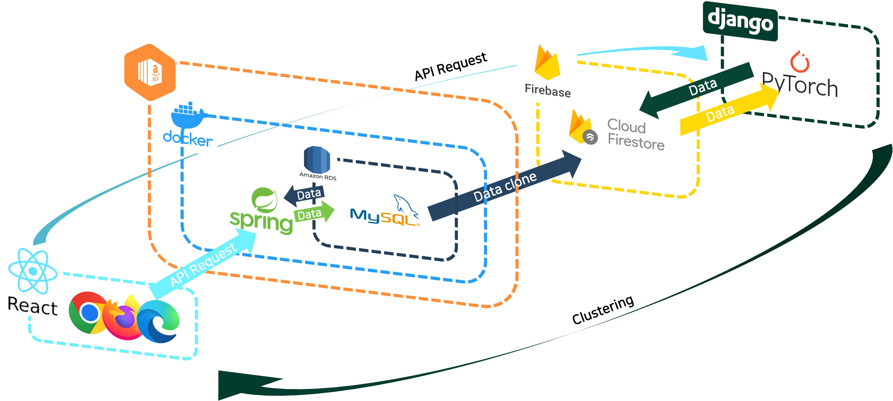

# waitForm

## Directory Guide
각 폴더에 대한 세부사항은 각 폴더 내에 있는 `readme.md` 파일을 참고해주세요.
```bash
waitForm
├── Crwaling        # crawling folder
│   ├── *.zip       # crawling data
│   ├── *.ipynb     # crawling code
│   └── *.py        # crawling code
│ 
├── JuYoungKim      # front folder
│   ├── css         # front css folder
│   ├── html        # front html folder
│   ├── images      # front image folder
│   └── wairformReact   # front javascript folder
│ 
├── Models          # deep-learning model folder
│   └── *.ipynb     # deep-learning model code
│ 
├── backend         # back folder
│   ├── WaitForm    # spring folder
│   └── .gitignore  # gitignore
│ 
├── Workflow        # framework image folder
│   └── *.png       # used in readme.md
│ 
├── .gitignore      # gitignore
└── README.md       # readme
```

## Work Flow
1. Overview  
    Requester는 쉽게 말하면 고용자, Creator는 노동자라고 풀이할 수 있습니다. Requester는 특정 그림체, 화풍, 스킬 보유자 등을 찾으려는 사람입니다. 이 사람들은 원하는 그림이나 글을 올리게 되면 우리의 머신러닝 모델을 통해 원하는 결과를 얻습니다. Creator는 자신의 포트폴리오를 업로드하여 같은 방식으로 모델을 돌려 어느 성향인지 구별해냅니다. 플랫폼의 역할은 그 둘의 사이를 중개, 중재하는 역할입니다.  
   
2. Structure  
   우리 프로젝트의 모식도입니다.  
   
3. Service Sequence Diagram  
   사용자들은 아래와 같은 프로세스를 거칩니다.  
   
4. Service Details  
   플랫폼 내부적으로는 아래와 같이 나눠집니다.   
    


## Contributors
- frontend [@KimJooY](https://github.com/KimJooY)
- backend [@alanhakhyeonsong](https://github.com/alanhakhyeonsong)
- ml [@tpqls0327](https://github.com/tpqls0327) [@ponopono0322](https://github.com/ponopono0322)

