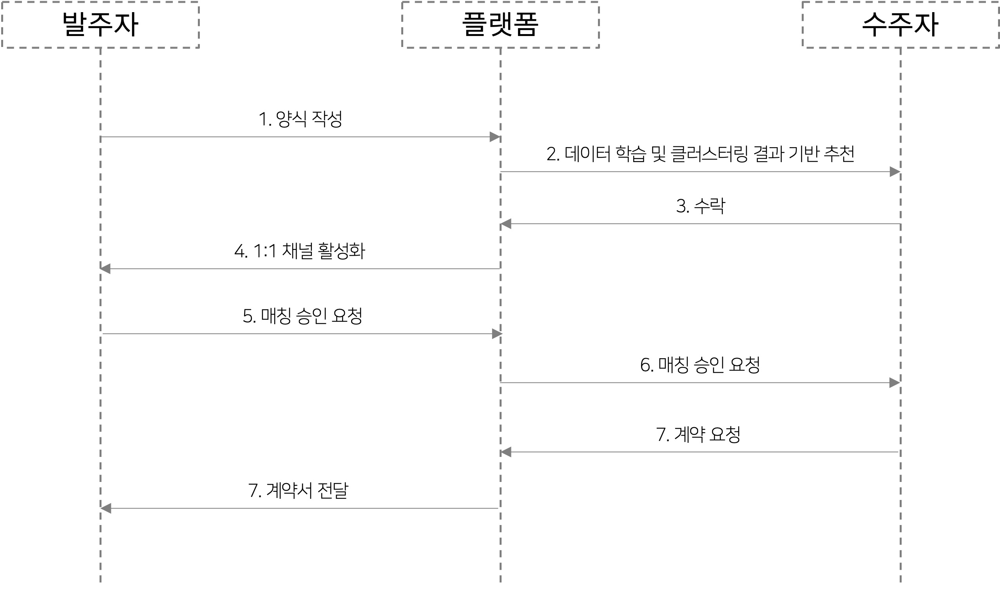
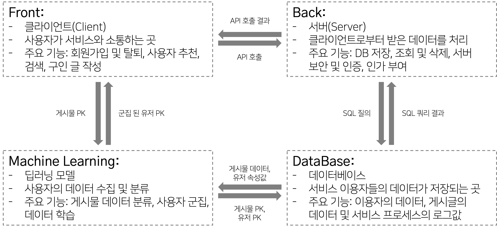

# waitForm

## Directory Guide
See more info in each folder md files.
```python
waitForm
├── Crwaling        # crawling folder
│   ├── *.zip       # crawling data
│   ├── *.ipynb     # crawling code
│   └── *.py        # crawling code
│ 
├── JuYoungKim      # front folder
│   ├── css         # front css folder
│   ├── html        # front html folder
│   ├── images      # front image folder
│   └── wairformReact   # front javascript folder
│ 
├── Models          # deep-learning model folder
│   └── *.ipynb     # deep-learning model code
│ 
├── backend         # back folder
│   ├── WaitForm    # spring folder
│   └── .gitignore  # gitignore
│ 
├── Workflow        # framework image folder
│   └── *.png       # used in readme.md
│ 
├── .gitignore      # gitignore
└── README.md       # readme
```

## Work flow
1. Overview  
   
2. Service Sequence Diagram  
   
3. Service details  
   


## Contributors
- frontend [@KimJooY](https://github.com/KimJooY)
- backend [@alanhakhyeonsong](https://github.com/alanhakhyeonsong)
- ml [@tpqls0327](https://github.com/tpqls0327) [@ponopono0322](https://github.com/ponopono0322)

